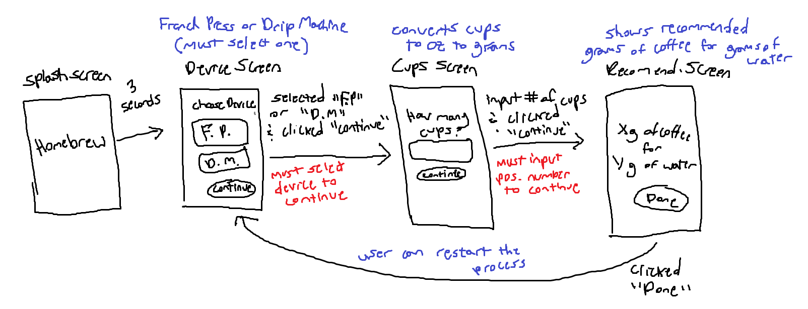

# Homebrew Project

The purpose of this project is to practice Pair-Programming and utilize Behavior-Driven Design (BDD), Test-Driven Development (TDD) and Continuous Integration (CI).

### Before You Start

Before you start writing any code, remember you will be graded based on your development process and **NOT** just the finished outcome. Make sure to read through this README to have a good understanding of how to complete this project. To avoid losing any points, make sure you follow the rules below.

**Rules:**

- Do **NOT** commit & push directly into the master/main branch.
- Do **NOT** merge failed tests into the master/main branch. (*You can still commit & push to your other branches*)
- Do **NOT** merge into the master/main branch without a pull request.
- Do **NOT** merge into the master/main branch without filling out your `pull_request_template.md` file.

<br>

## Design & Planning (Validation)

This phase utilizes <span style="color: #0096FF">**Behavior-Driven Design (BDD)**</span> to determine the application's behavior and fucntionality from the customer's request. For this phase you do not need to add any material, simply read through it to understand the behavior of this application.

**Customer Request:**

*"I would like an application for coffee aficionados that tells them how to prepare the best French Press or Drip Machine coffee possible. Through the app the users can choose which type of coffee machine they have and then input how much water will use. A French Press machine should have a 1/14 coffee-to-water ratio and Drip Machine a 1/17 coffee-to-water ratio. The result should be shown to them in ounces and grams."*

Upon hearing their request you draft the following user stories.

### User Stories

- As a coffee-drinker, I should be able to choose between a French Press or Drip Machine coffee device, so that I know the correct coffee-to-water ratio for that specific device.

- As a coffee-drinker, I should be able to input how many ounces of water I intend to use, so that I know how many grams of coffee I need for my device.

- As a coffee-drinker, I should see my recommended coffee-to-water ratio in grams and ounces, so that I can begin preparing my coffee.

- As a coffee-drinker, I should be able to restart the process, so that I can select a new device or input a different water amount.


Using the above user stories you draft multiple validation sketches and finally the customer agrees to the sketch below.

### Validation Sketch



Messy isn't it? You decide the above validation sketch isn't good enough to serve as your guide, so you quickly draft the low-fidelity prototype below.

### LoFi Prototype


This prototype is much nicer! Use this Figma lofi prototype to serve as your guide for building the application.

<br>

## Testing (Verification)

This phase utilizes <span style="color: #0096FF">**Test-Driven-Development (TDD)**</span> where we develop our tests first based on our validation sketch and lofi prototype then afterwards write code to pass those tests and refactor if necessary.


From the prototypes in the validation phase above you create the following **Acceptance Criteria** in Gherkin style.

### Acceptance Criteria

<div style="color: #4F7942">

**Happy Paths:**

- **GIVEN** I am on the Coffee Device Selection Screen, **WHEN** I tap "French Press" **AND** I tap "Continue" **AND** I input "16" **AND** I tap "Continue", **THEN** I should see "32.4 g - medium ground coffee" **AND** I should see "16 oz - water".


- **GIVEN** I am on the Coffee Device Selection Screen, **WHEN** I tap "Drip Machine" **AND** I tap "Continue" **AND** I input "16" **AND** I tap "Continue", **THEN** I should see "26.7 g - medium ground coffee" **AND** I should see "16 oz - water"

- **GIVEN** I have already selected a coffee device and input a # of oz **AND** I am on the Recommendation Screen, **WHEN** I tap "Done", **THEN** I should be taken back to the Coffee Device Selection Screen.

</div>


**Sad Paths:**

- ADD YOUR SAD PATHS HERE.


<br><br>

### Unit Tests

Write all your brew calculation functions inside the `CoffeeTools` class located in the `lib/utils/coffee_tools.dart` file.

Create your unit tests in `test\unit_tests.dart` to test functions.

**Terminal:**

```console
flutter test test/unit_tests.dart
```

**In VS Code:**

1. Open the test/unit_tests.dart file
2. While in the test/unit_tests.dart file
3. Select the Debug menu
4. Click the Run Without Debuging option

### Integration Tests

Create your integration tests based on your Acceptance Criteria inside the in `test\integration_tests.dart` to test functions.

**Terminal:**

```console
flutter test test/integration_tests.dart
```

**In VS Code:**

1. Open the test/integration_tests.dart file
2. While in the test/integration_tests.dart file
3. Select the Debug menu
4. Click the Run Without Debuging option

<br>

## Code Implementation

Use <span style="color: #0096FF">**Continuous Integration (CI)**</span> when updating your GitHub repository. CI is one of the 2 phases of **DevOps** and it focuses on updating your source code in a way that almost 100% prevents Regression.


The first step of CI is to setup your **Configuration-as-Code (CaC)**, this step is where you configure your code repository to enforce the CI pipeline.

### Configuration-as-Code

This has **NOT** ben setup for you.

- Create a `.github/workflows/flutter_test.yaml` file that forces GitHub Actions to run all of your tests when a Pull Request is made.

- Create a `pull_request_template.md` file where you can put a description of your Pull Request.

- Setup up a **Branch Protection Rule** that instructs GitHub not to allow any changes to the `main/master` branch unless it's through a Pull Request.

### Branching

You can create a new branch and update your GitHub repo all from your terminal. Simply create a new branch, the swith over to it, and lastly push to GitHub. You can use the commands below.

```console
git checkout -b new_branch
git push -u origin new_branch
```

### Pull Requests

A pull request is when you request to merge the commits from one branch into another. For this project all of your changes should be done on another branch and NEVER directly on the `main/master` branch.

Look at your PowerPoint slides for guidance on how to create Pull Requests.

Your partner will approve your PR.

### Start Your Project!